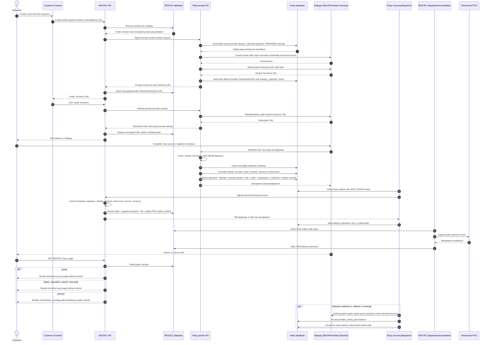

# Safepay Hosted Checkout End-to-End Audit

Audit date: 2026-08-01  
Scope: the Paely and RESTEC repositories, their sandbox deployments, Safepay Hosted Checkout, both database projections, both outboxes, frontend polling, and reconciliation.

## Outcome

The failed payment was not stuck at Safepay webhook verification. Safepay had completed the payment and Paely had atomically committed it. The first broken hop was the Paely-to-RESTEC outbox: its event was still `pending` with `attempt_count = 0` because no dispatcher was running. A second independent defect caused terminal RESTEC return pages to retain an unconditional refresh tag, which explains the repeated terminal output.

Manual dispatch proved the already-deployed financial chain can reach its terminal state:

- Paely payment: `PAID`
- Paely attempt: `SUCCEEDED`
- Paely private session: `paid`
- verified webhook: `processed`
- Paely canonical outbox: `delivered`
- RESTEC payment session: `paid`
- RESTEC bill: `paid`
- RESTEC inbox count for `payment.completed`: `1`
- RESTEC POS outbox: `delivered`
- mock POS receipt count for the event: `1`
- dead-letter flag: `false`

That recovery required manual scheduler invocation. The code and migrations in this audit automate the missing jobs and remove terminal polling, but they are not live until both projects are migrated and deployed.

## Complete sequence

The important architectural fact is that Safepay does **not** webhook RESTEC directly. Safepay webhooks Paely; Paely commits its financial projection and emits a durable signed canonical event; RESTEC consumes that event and emits its own POS event.

## State machines

### Safepay/canonical provider state

| State                | Class                                                              | Allowed progression                                                         |
| -------------------- | ------------------------------------------------------------------ | --------------------------------------------------------------------------- |
| `INITIATED`          | active                                                             | `REQUIRES_ACTION`, `PROCESSING`, `AUTHORIZED`, success, or failure terminal |
| `REQUIRES_ACTION`    | active                                                             | `PROCESSING`, `AUTHORIZED`, success, or failure terminal                    |
| `PROCESSING`         | active                                                             | `AUTHORIZED`, success, or failure terminal                                  |
| `AUTHORIZED`         | active for captured checkout; terminal for auth-only certification | success or failure terminal                                                 |
| `PAID`               | success                                                            | `SETTLED`, `PARTIALLY_REFUNDED`, `REFUNDED`, or `DISPUTED`                  |
| `SETTLED`            | success                                                            | `PARTIALLY_REFUNDED`, `REFUNDED`, or `DISPUTED`                             |
| `FAILED`             | failure terminal                                                   | same state, or late authoritative `PAID`                                    |
| `CANCELLED`          | failure terminal                                                   | same state, or late authoritative `PAID`                                    |
| `EXPIRED`            | failure terminal                                                   | same state, or late authoritative `PAID`                                    |
| `PARTIALLY_REFUNDED` | post-payment terminal for checkout                                 | same state or `REFUNDED`                                                    |
| `REFUNDED`           | terminal                                                           | same state only                                                             |
| `DISPUTED`           | post-settlement exception                                          | same state; RESTEC contract escalation is manual review                     |

Late verified success is intentionally allowed from `FAILED`, `CANCELLED`, or `EXPIRED`: a customer return or local clock must never override authoritative provider evidence. Stale polling results are compare-and-swap updates and cannot regress a newer state.

### Paely private integration session

`creating -> requires_customer_action | processing | paid | failed | expired`

`requires_customer_action -> processing | paid | failed | cancelled | expired`

`processing -> paid | failed | cancelled | expired`

`paid -> partially_refunded | refunded`

`failed | cancelled | expired -> paid` only for late authoritative success

`partially_refunded -> partially_refunded | refunded`

`refunded` has no forward transition.

### Paely payment attempt projection

| Provider/session result           | Attempt status                    |
| --------------------------------- | --------------------------------- |
| provider request durably prepared | `PREPARED`                        |
| customer action required          | `REQUIRES_ACTION`                 |
| processing or authorized          | `PROCESSING`                      |
| paid or settled                   | `SUCCEEDED`                       |
| failed                            | `FAILED`                          |
| cancelled                         | `CANCELLED`                       |
| expired                           | `EXPIRED`                         |
| partial/full refund               | `PARTIALLY_REFUNDED` / `REFUNDED` |

### RESTEC public payment session

States are `creating`, `requires_customer_action`, `processing`, `paid`, `failed`, `cancelled`, `expired`, `partially_refunded`, and `refunded`. The browser-terminal set is `paid`, `failed`, `cancelled`, `expired`, `partially_refunded`, and `refunded`. All of those now stop refresh/polling.

`payment.failed` plus an explicitly reported `cancelled` session remains `cancelled`; it is no longer collapsed into `failed`.

## Polling and retry inventory

| Poller/job                              |                  Interval | Exit/limit                                                                         | Failure behavior                                              |
| --------------------------------------- | ------------------------: | ---------------------------------------------------------------------------------- | ------------------------------------------------------------- |
| Paely `PaymentPage` status poll         |                 4 seconds | all backend terminal statuses; 15-minute deadline; abort on unmount or replacement | visible timeout error; overlay cleared in `finally`           |
| Paely embedded card confirmation        |                 2 seconds | all backend terminal statuses; 60-second deadline; abort on unmount or replacement | visible failure/timeout callback                              |
| RESTEC return page                      |        configured seconds | terminal state or local `expires_at`                                               | terminal HTML has no refresh tag                              |
| Paely RESTEC outbox                     |    scheduled every minute | delivered; max attempts; max age                                                   | transient retry with lease/backoff; permanent 4xx dead-letter |
| Verified Safepay webhook recovery       | scheduled every 5 minutes | processed or 10 attempts by default                                                | exponential backoff, then `manual_review`                     |
| Missing-webhook provider reconciliation | scheduled every 5 minutes | terminal provider state, session expiry, or 10 attempts by default                 | explicit `reconciliation_exhausted_at` and safe error code    |
| RESTEC POS outbox                       |    scheduled every minute | delivered or configured max attempts                                               | leased transient retry; permanent failures dead-letter        |
| RESTEC payment-session comparison       | scheduled every 5 minutes | active set ends at terminal/expiry                                                 | mismatch is audited; no partial financial write               |

Paely outbox delays are bounded at 30 seconds, 2 minutes, 10 minutes, 30 minutes, 2 hours, 6 hours, then 12 hours, with maximum attempt and event-age checks. Claiming and delivery use leases, so a crashed worker is reclaimable.

## Discovered defects and applied fixes

| ID   | Defect                                                                                                    | Effect                                                                | Applied change                                                                                                                  |
| ---- | --------------------------------------------------------------------------------------------------------- | --------------------------------------------------------------------- | ------------------------------------------------------------------------------------------------------------------------------- |
| F-01 | Paely canonical outbox had no active scheduler                                                            | Paely was paid while RESTEC remained `requires_customer_action`       | Added Vercel cron, GET-capable protected job route, and GitHub Actions fallback                                                 |
| F-02 | RESTEC terminal return page always emitted a refresh tag                                                  | Infinite terminal browser polling and repeated logs                   | Refresh only for active sessions; all terminal/locally expired states render once                                               |
| F-03 | Generic payment trigger emitted a second event for hosted-session payments                                | Duplicate events raced; legacy generic events were rejected by RESTEC | Hosted payments are excluded from the generic trigger; pending legacy duplicates are quarantined as dead-letter evidence        |
| F-04 | Missing immutable destination fields could be treated as a matching route                                 | Legacy/unscoped outbox rows could reach the current RESTEC receiver   | Destination environment, service, origin, and path must all be present and exact                                                |
| F-05 | Verified-but-unprocessed webhooks had only a manual CLI recovery path                                     | A transient post-verification failure could remain forever            | Added leased scheduled claims, bounded exponential retries, and manual-review exhaustion                                        |
| F-06 | No recovery existed when a Safepay webhook/callback never arrived                                         | Active session could remain initiated/processing forever              | Added exact-merchant authenticated reporter lookup and durable `provider_status_api` evidence using the same atomic commit path |
| F-07 | Claimed webhook rows could remain `processing` after a worker crash                                       | Retry worker could strand its own claim                               | Stale `processing` rows become reclaimable after their lease/backoff timestamp                                                  |
| F-08 | Session provider reconciliation had no maximum attempt count                                              | Background retry could continue forever                               | Added a configurable cap and `reconciliation_exhausted_at` marker                                                               |
| F-09 | Stale provider polling could overwrite newer canonical states                                             | Webhook success could regress to processing/failure                   | Added compare-and-swap predecessor sets and logs for ignored stale updates                                                      |
| F-10 | Several financial database errors and recovery persistence errors were unchecked or swallowed             | Execution could stop after partial application with weak diagnostics  | All relevant reads/writes are checked; catches log sanitized type/code and persist retryable/manual state                       |
| F-11 | RESTEC accepted an empty RPC result as a successful canonical event commit                                | Event could be acknowledged without a proven transaction result       | Empty/incomplete RPC results now fail closed                                                                                    |
| F-12 | RESTEC reconciliation wrote only the session for remote terminal mismatch/expiry                          | Bill/order/POS projection could remain stale                          | Terminal mismatch is audited and left to the atomic canonical event pipeline                                                    |
| F-13 | Visiting Safepay's cancel return URL was treated as provider cancellation                                 | A browser navigation could overwrite financial truth                  | Cancel return is audit-only; only verified provider evidence changes payment state                                              |
| F-14 | Provider `CANCELLED` became session/attempt `failed`/`FAILED`                                             | Cancellation semantics and polling decisions were lost                | Preserve `cancelled` and `CANCELLED` while retaining the compatible outward failure event                                       |
| F-15 | Linked payment attempts stayed `PREPARED` through later provider states and logs reported the stale value | Database and observability disagreed with the payment/session         | Added truthful attempt mappings for action, processing, terminal, and refund states                                             |
| F-16 | Frontend polling could overlap, survive unmount, or time out silently                                     | Duplicate requests and post-navigation state updates                  | Abort previous/unmounted polls, handle every terminal status, and surface bounded timeout errors                                |
| F-17 | RESTEC checkout expiry/cancel paths performed session-only financial mutations                            | Partial projections and races with webhook delivery                   | Removed browser-driven financial mutations; expiry is projected by Paely's atomic expiry/outbox path                            |
| F-18 | RESTEC POS dispatch and session reconciliation had no deployment scheduler                                | POS delivery and missing-event diagnosis depended on manual calls     | Added Vercel cron and GitHub Actions fallback                                                                                   |
| F-19 | Certification default pointed at a nonexistent Paely dispatcher path                                      | Certification could time out despite valid code                       | Corrected to `/api/internal/integrations/restec/v1/outbox/dispatch`                                                             |
| F-20 | `AUTHORIZED` existed in TypeScript but not the PostgreSQL provider enum                                   | Authorized updates could fail at the database boundary                | Migration adds `AUTHORIZED` to `payment_provider_status`                                                                        |
| F-21 | Dispatcher auth preferred one secret with `A                                                              |                                                                       | B`                                                                                                                              | Vercel `CRON_SECRET` failed whenever a different operator token was also configured | Constant-time validation accepts either configured server-side secret |
| F-22 | Webhook logs stopped at verification and did not guarantee correlation fields                             | Failures after verification were hard to locate                       | Added structured stage logs with complete nullable correlation context and duration                                             |
| F-23 | RESTEC job catches and global handler hid the error class                                                 | Operators saw a generic 500 without a safe cause                      | Added sanitized structured error classification and job summaries                                                               |
| F-24 | New-order checkout called the session store with a database session ID where a session token was required | Session identity could be corrupted after order creation              | Removed the invalid write; `ensureCustomerSession` remains the single token/ID owner                                            |

## Silent-stop audit

No empty catch in the hosted financial path is allowed to acknowledge success or abandon a state transition.

- Signature parser catches return an explicit verification failure.
- Provider response JSON catches retain a sanitized response description.
- DNS/URL catches fail closed with a classified dependency or destination error.
- Webhook database catches persist `retryable` or `manual_review`; failures to persist are raised.
- Provider-create ambiguity persists a recoverable session error; failure to persist that fact is logged.
- Paely atomic-commit exceptions retain verified inbox evidence and become scheduled retries.
- RESTEC event-commit exceptions return non-2xx so Paely's outbox retries.
- RESTEC POS delivery exceptions record an attempt and choose retry/dead-letter deterministically.
- Optional saved-card metadata and optional HULM side effects are warning-logged; they are not part of the RESTEC hosted financial commit.
- Remaining intentionally ignored catches are nonfinancial browser storage, defensive diagnostics parsing, or safe response parsing. They cannot mark a payment complete or suppress a required status write.

## Database consistency and transaction boundaries

The network calls cannot participate in one distributed database transaction, so the implementation uses local atomic transactions plus durable idempotent outboxes.

1. Before Safepay I/O, Paely atomically reserves the private operation, canonical payment, and `PREPARED` attempt.
2. After Safepay returns a tracker, Paely atomically attaches the provider evidence to the private session.
3. A verified webhook or authenticated provider-reconciliation result enters one Paely RPC that locks and validates the session, payment, bill, connection, and webhook row. It updates the canonical payment, attempt, private session, transaction, integration bill, order, webhook evidence, and Paely outbox together. Any failure rolls all of them back.
4. RESTEC consumes the signed canonical event in one RPC that updates its payment session and bill while inserting the immutable inbox and POS outbox. Empty RPC results fail closed.
5. POS delivery is external I/O after commit. Its outbox row is leased and updated idempotently after the connector response.

The hosted tracker is not a separate mutable source of truth: its plaintext lives on the canonical provider payment, its hash and encrypted checkout URL live on the provider session, and every webhook/reconciliation commit revalidates tracker, merchant account, environment, amount, currency, order, and private-session linkage.

## Idempotency and race analysis

- Webhook identity is provider event ID plus immutable raw-body hash and merchant account. A duplicate with different evidence is rejected.
- Paely webhook/outbox effects are protected by database row locks and a unique outbox deduplication key.
- RESTEC inbox and POS outbox insertion are exactly-once per private event.
- Outbox claims use `FOR UPDATE SKIP LOCKED` plus leases; multiple cron/workflow invocations can safely overlap.
- Checkout URL refresh uses an acquisition token/lease; concurrent browser requests cannot replace one another's URL.
- Browser cancel and return routes no longer write financial state.
- Local expiry and verified webhook delivery cannot partially overwrite one another. Paely's atomic state machine permits a late authoritative success.
- Generic payment triggers no longer race the hosted-session projection.
- Polling updates use allowed-predecessor compare-and-swap, so an old provider response cannot regress a newer webhook state.
- Reconciliation does not overwrite terminal projections; discrepancies become audit records for the canonical event pipeline or operator review.

## Structured observability

Paely now emits `webhook_received`, `webhook_verified`, `webhook_parsed`, `event_recognized`, `status_extracted`, `canonical_payment_loaded`, `payment_attempt_loaded`, `payment_updated`, `attempt_updated`, `order_updated`, `session_updated`, `transaction_committed`, `frontend_notification_queued`, dispatcher delivery, retry, and failure stages.

RESTEC emits receive/verify/parse/recognize/commit stages, `frontend_notified`, `payment_session.polling_continues`, `payment_session.polling_finished`, POS delivery outcomes, and reconciliation mismatch/failure events.

Webhook stage records always contain these keys, using explicit `null` where a system does not own or know a value: `payment_id`, `payment_attempt_id`, `merchant_payment_account_id`, `private_payment_session_id`, `provider_session_id`, `provider_transaction_id`, `provider_status`, `canonical_status`, `attempt_status`, `session_status`, `order_id`, `event_type`, `webhook_id`, and `processing_duration_ms`.

## Verification performed

- Live sandbox evidence was traced across Paely webhook, Paely financial tables, Paely outbox, RESTEC inbox/session/bill, RESTEC POS outbox, and mock POS receipt.
- Manually invoking the previously absent Paely dispatcher moved the observed RESTEC session to `paid`.
- Manually invoking the RESTEC POS dispatcher delivered two pending POS events with no retry or dead-letter.
- Paely Safepay tests: 146/146 passing.
- Paely RESTEC tests: 86/86 passing, including provider-status reconciliation and scheduler hardening.
- RESTEC tests: 71/71 runnable tests passing; three database-gated integration tests are intentionally skipped in the ordinary run.
- Paely production bundles: all four applications build successfully.
- Paely API TypeScript check: passing. The repository-wide project-reference typecheck still has pre-existing unrelated UI/generated-Supabase-type failures (for example the logo `xxl` alias and stale order/payment generated fields); those are outside this payment pipeline patch.
- RESTEC full workspace build: successful, including API startup/runtime smoke verification.
- Diff whitespace validation: clean apart from repository line-ending notices.

The deployed RESTEC return page was also inspected after the financial state became `paid`; it still contained the old refresh tag. The new no-refresh behavior is covered by a local test, but a fresh live payment cannot prove that browser behavior until this patch is deployed.

## Deployment and final certification gate

Apply Paely migrations in timestamp order, deploy Paely, then deploy RESTEC. Configure `CRON_SECRET` in both Vercel projects. Keep the operator tokens configured as separate secrets. If GitHub Actions is used as a redundant scheduler, configure Paely's `PAELY_SANDBOX_BASE_URL`/`RESTEC_DISPATCH_TOKEN` secrets and RESTEC's `RESTEC_API_BASE_URL`/`RESTEC_INTERNAL_JOB_TOKEN` secrets.

[Vercel cron](https://vercel.com/docs/cron-jobs) invokes the configured path with `GET` and can attach `CRON_SECRET` as a bearer token; the job routes support that contract. [Vercel does not retry failed cron invocations](https://vercel.com/docs/cron-jobs/manage-cron-jobs), which is why the database leases/retries and optional GitHub fallback remain necessary. [Minute-level schedules require an appropriate Vercel plan](https://vercel.com/docs/cron-jobs/usage-and-pricing).

A final post-deployment certification payment must prove all of the following without manual dispatcher calls:

1. Safepay reaches one terminal result.
2. Paely webhook evidence is verified and processed once.
3. Paely payment, attempt, private session, bill, and order agree.
4. Paely canonical outbox is delivered automatically.
5. RESTEC session and bill reach the same terminal result.
6. RESTEC inbox contains exactly one matching canonical event.
7. RESTEC POS outbox is delivered automatically and exactly one matching receipt exists.
8. The customer return page contains no refresh tag once terminal.
9. No retryable webhook/session has exhausted recovery; no related event is dead-lettered.

Until that deployment and fresh customer-driven checkout occur, the code is verified locally and the existing sandbox financial chain is recovered, but the new scheduler/no-refresh behavior is not truthfully certified live.
