# Restec–Paely Complete Flow

> **INTERNAL ONLY — DO NOT SHARE WITH POS PARTNERS**

Public boundary: `POS → Restec → POS response`. Private implementation: `POS → Restec → Paely → Restec → POS response`. Reverse flow: `Paely → Restec inbox/projection/outbox → signed Restec webhook → POS`.

## Responsibility and truth

| Fact                                     | Source of truth                      | Restec role                                        |
| ---------------------------------------- | ------------------------------------ | -------------------------------------------------- |
| POS invoice, items and external table ID | POS                                  | Validate, version and map                          |
| Stable QR and customer payment flow      | Paely                                | Resolve mapped table; never regenerate QR per bill |
| Verified digital payment                 | Paely after provider verification    | Project and notify                                 |
| Cash/terminal completion                 | POS                                  | Authenticate and relay privately                   |
| Public bill state                        | Restec projection of committed facts | Reconcile, never invent from UI redirects          |
| POS delivery state                       | Restec outbox                        | Retry/dead-letter independently                    |

Public IDs (`ptr_`, `loc_`, `tbl_`, `bil_`, `pay_`, `evt_`) are separate from encrypted/private references. API keys are stored as prefix plus scrypt hash; retrievable secrets are AES-256-GCM encrypted. Service-role access is server-only.

## Endpoint matrix

| Visibility      | Endpoint                                                    | Purpose                        |
| --------------- | ----------------------------------------------------------- | ------------------------------ |
| Public          | `GET /health`                                               | Safe health response           |
| Public          | `PUT/GET /v1/locations/{locationId}/bills/{externalBillId}` | Bill sync/reconciliation       |
| Public          | `POST .../external-payments`                                | Completed POS payment fact     |
| Public          | `GET .../tables`                                            | Public mappings                |
| Sandbox public  | `POST /v1/test/scenarios`                                   | Durable demonstrations         |
| Private         | Paely bill/payment/table endpoints                          | Hidden upstream operations     |
| Private inbound | `POST /api/internal/events/paely/v1`                        | Signed committed payment event |
| Protected job   | `/api/internal/jobs/dispatch-pos-events`                    | Outbox worker                  |
| Protected job   | `/api/internal/jobs/reconcile`                              | Compare and audited control    |

## POS-originated sequences

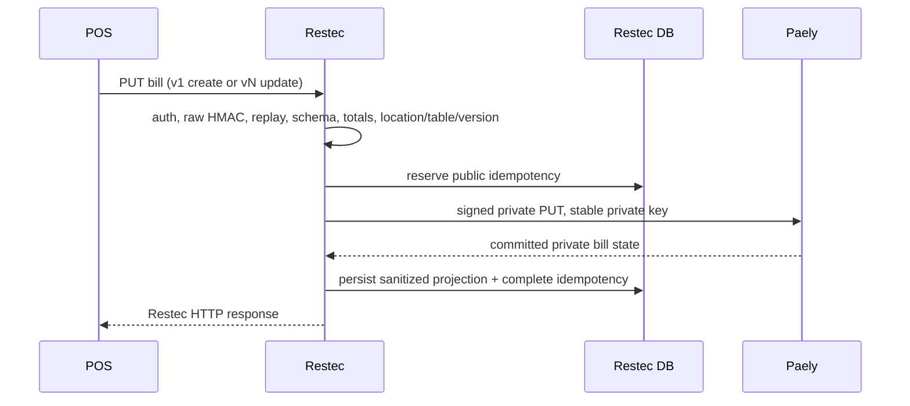

```mermaid
sequenceDiagram
  participant POS
  participant R as Restec
  participant P as Paely
  POS->>R: GET bill
  R->>R: authenticate, sign/replay checks, authorize
  R-->>POS: stored canonical Restec state
  Note over R,P: Protected reconciliation separately GETs Paely and compares; it does not rewrite truth.
```

```mermaid
sequenceDiagram
  participant POS
  participant R as Restec
  participant P as Paely
  POS->>R: POST completed cash/card/wallet/voucher
  R->>R: reject sensitive fields; check duplicate, currency, due and payment-in-progress
  R->>P: signed private external-payment fact
  P-->>R: committed state
  R-->>POS: sanitized updated bill response
```

Duplicate public requests return the stored response for the same key/body. A reused key with different input fails. A private timeout leaves failed/resumable operation state; the next safe retry derives the same private key but generates a fresh request ID, timestamp, and signature.

### Scenario-specific sequence index

Bill creation and bill update use the first sequence above; creation requires version 1, while update requires a strictly increasing version. The following focused diagrams make the different operations and recovery decisions explicit.

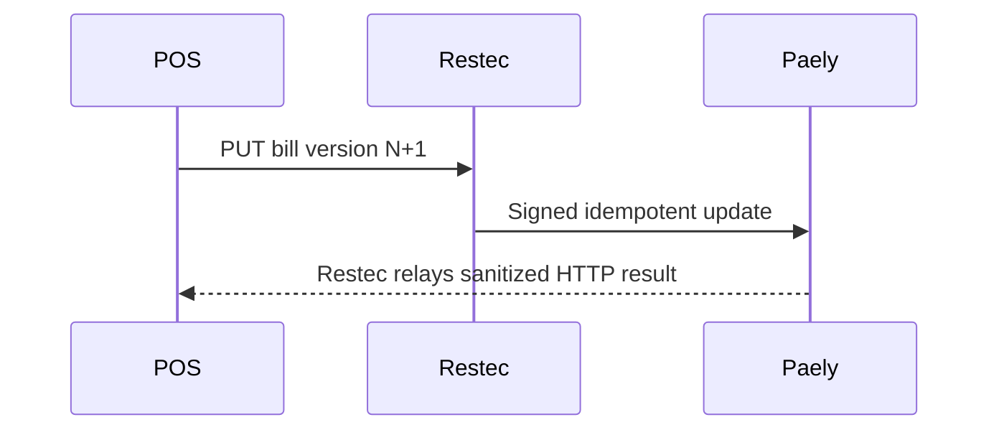

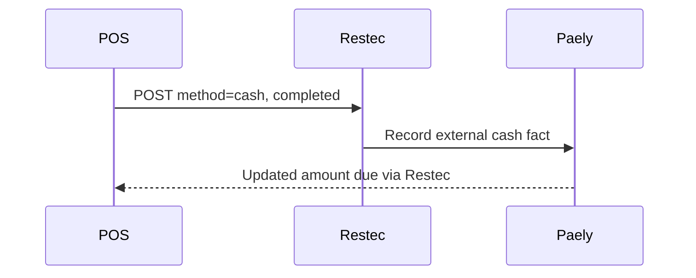

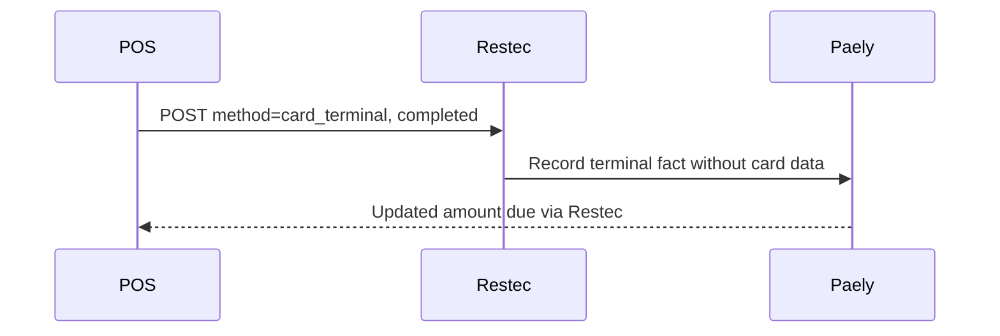

## Paely-originated sequences

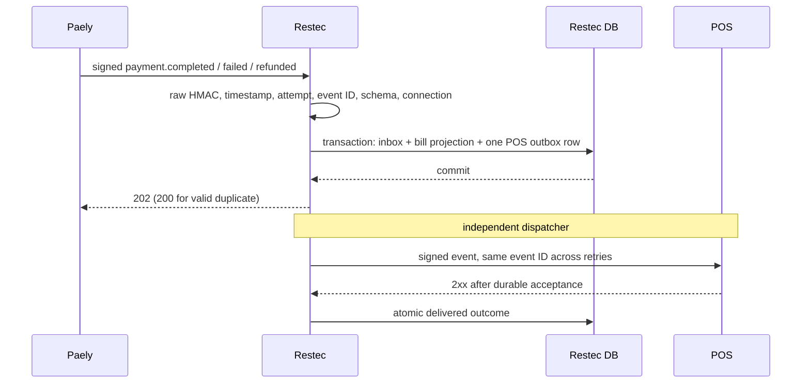

The same sequence covers partial payment: `amount_due` stays positive and `payment_status=partially_paid`. Full success has zero due and `paid`. Failure preserves committed amounts. Refund increments refunded state according to the received committed projection. A valid duplicate returns success without a new outbox financial action; a reused event ID with different bytes is a conflict.

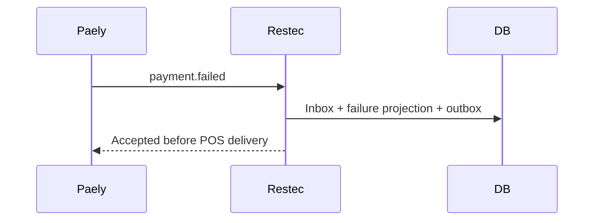

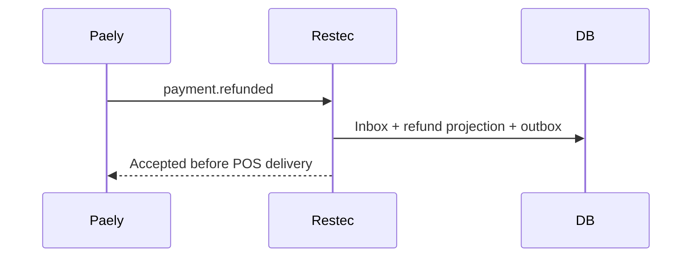

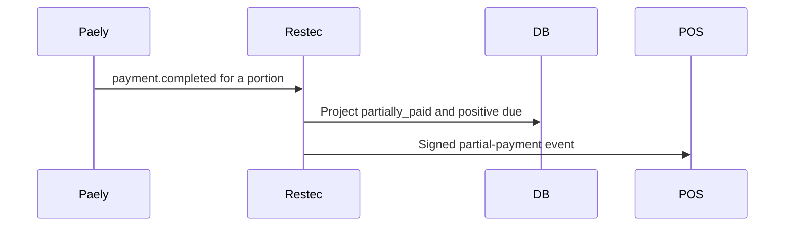

```mermaid
sequenceDiagram
  Paely->>Restec: Same event ID and bytes
  Restec->>DB: Detect existing inbox hash
  Restec-->>Paely: 200; no second outbox action
```

## Failure and recovery sequences

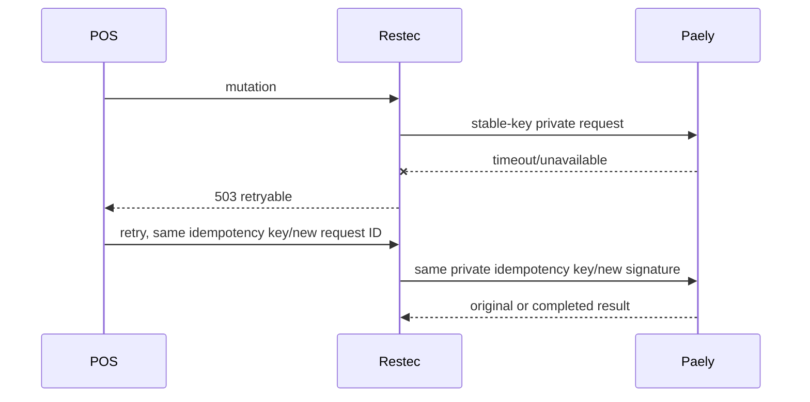

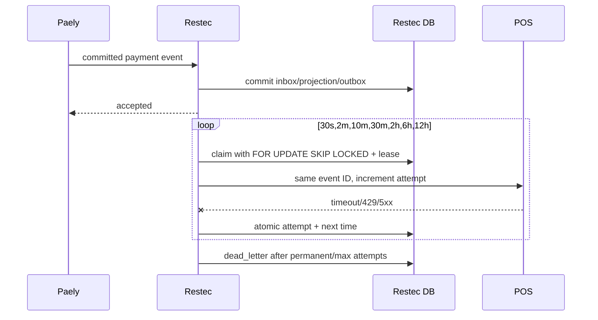

An audited replay changes a dead-letter row back to pending with the same event ID. A worker crash is recovered when the expiring lease is released. Out-of-order events are accepted only as explicit committed projections; reconciliation flags mismatches for review rather than automatically rewriting financial truth.

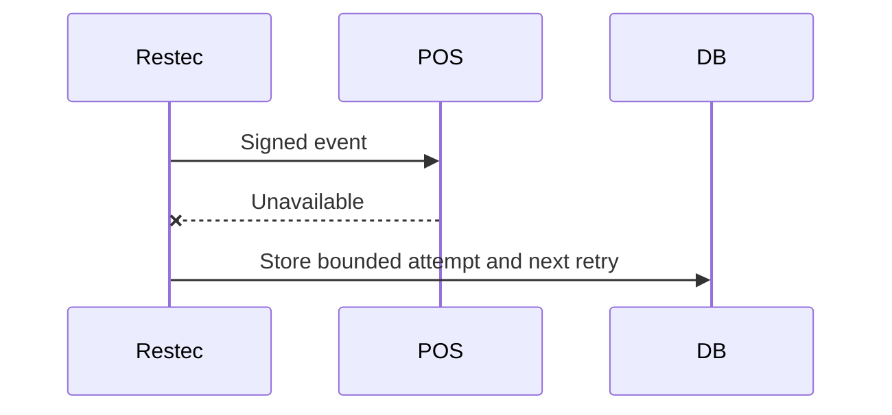

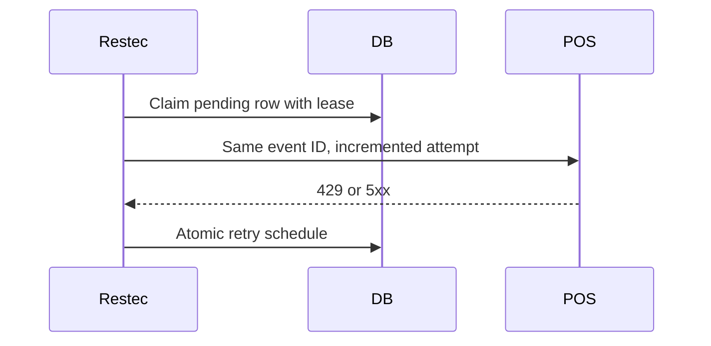

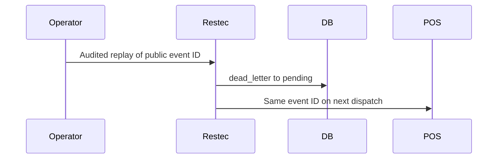

## Transaction boundaries

Restec cannot provide a distributed database transaction with Paely. Boundary A reserves public idempotency. Boundary B is the private service's idempotent commit. Boundary C persists Restec's public projection and response. Inbound event acceptance is a single Restec database transaction covering inbox dedupe, projection update, and outbox insert. POS delivery is never inside the Paely acknowledgement transaction.

## Deployment and sandbox demonstration

Apply migrations, deploy sandbox API with Supabase repository, configure private credentials and scheduler, create sandbox POS credentials, create a demo bill, then run `payment.completed`. Demonstrate `dummy POS → Restec → mock Paely → Restec response`, followed by `dummy signed Paely event → Restec inbox/outbox → mock POS`. Run duplicate, partial, full, refund, 429, 500, timeout, and permanent failure cases. Promote only after remote tests, real Paely sandbox certification, monitoring, secrets, and controlled restaurant smoke test.
