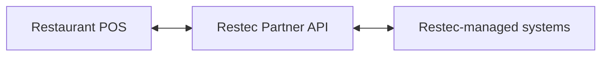

# Restec POS Partner v1

This package is the contract for connecting a restaurant POS to Restec. All POS requests go to the Restec Partner API, and all payment notifications come from Restec.

Start with [QUICKSTART.md](QUICKSTART.md), then complete [ONBOARDING_CHECKLIST.md](ONBOARDING_CHECKLIST.md) and [UAT_TEST_PLAN.md](UAT_TEST_PLAN.md). The machine-readable contract is `openapi/restec-pos-partner-v1.yaml`; the Postman collection and four language example sets are included at repository root.

The v1 contract supports bill upsert and lookup, table mapping lookup, customer payment-session creation and status, completed POS-originated payment reporting, and signed Restec payment webhooks. It does not provide POS-initiated payment void, refund, or reversal endpoints.

Money is always an integer number of minor currency units. Cardholder data must never be sent to Restec.

## Documentation map

- `AUTHENTICATION.md`: credentials and request signing.
- `API_REFERENCE.md`: verified paths, schemas, and status codes.
- `BILL_AND_ORDER_SYNC.md`: bill/table lifecycle.
- `PAYMENT_SYNC.md`: customer payment lifecycle.
- `TRADITIONAL_PAYMENT_SYNC.md`: cash and physical-terminal reporting.
- `WEBHOOKS.md`: event body, verification, acknowledgement, and deduplication.
- `IDEMPOTENCY_RETRIES.md`: safe request and webhook retry behavior.
- `ERRORS.md`: problem response format and stable codes.
- `CREDENTIAL_OWNERSHIP_MATRIX.md`: ownership, issuance, rotation, and revocation.
- `COMPATIBILITY_POLICY.md`: versioning guarantees.
